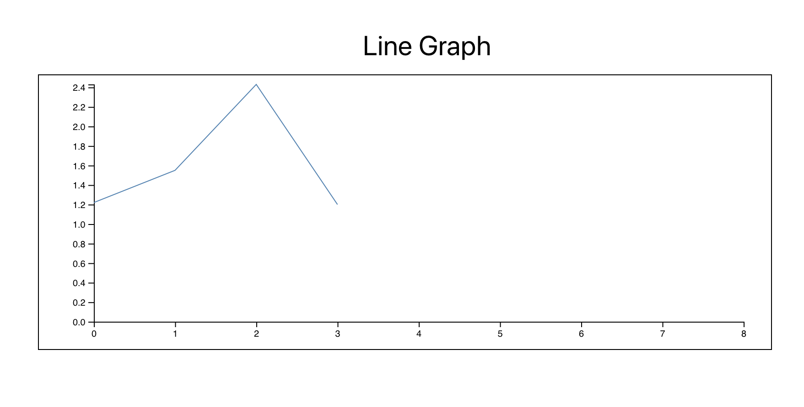
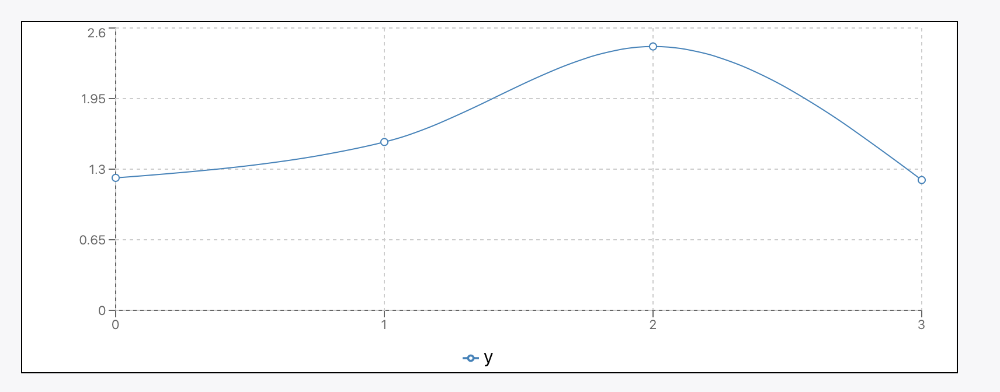

# React + D3.js Tutorial
- Representation Data on ReactJS 
- Using D3.js , rechart
- Boilerplate by CRA(Create React App)

## Line Chart 
- [Component Method](src/LineChart/Component.jsx)
- [With recharts Line Chart](src/LineChart/reChart.jsx)

### After Rendering 
- D3 LineChart

- ReCharts Line

